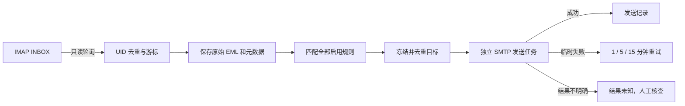

# Mail Agent

基于 Java 21 和 Spring Boot 4.1.1 的多邮箱规则转发系统。通过中文网页后台接入多个 IMAP/SMTP 邮箱，按主题、来源账号和 To/Cc 收件人匹配邮件，并将邮件转发、查看或通过受控链接分享。

> [!WARNING]
> 未配置管理员变量时，默认用户名和密码都是 `admin`。只要服务可能被其他设备访问，就应先修改 `ADMIN_USERNAME` 和 `ADMIN_PASSWORD`，并通过 HTTPS 反向代理提供服务。

> [!IMPORTANT]
> 请备份整个 `DATA_DIR`，尤其是隐藏文件 `.credentials.key`。邮箱凭据和可恢复的分享令牌使用该密钥加密；密钥丢失后无法解密已有数据。

## 功能

- 挂载多个支持密码或授权码认证的 IMAP/SMTP 邮箱。
- 每个账号独立配置服务器、端口、TLS、凭据、同步范围和启停状态。
- 按来源账号、主题和 To/Cc 地址配置转发规则。
- 主题支持包含、完全匹配和 RE2 正则表达式。
- 执行所有命中规则，合并并去重转发目标。
- 使用来源账号的 SMTP 转发正文、附件和 CID 内嵌图片。
- 邮箱内容支持按来源账号、发件人、收件人、主题、日期和转发状态筛选。
- 查看纯文本或经过安全清洗的 HTML 正文，并下载附件。
- 创建、查看、编辑、停用和删除公开分享链接。
- 分享页面支持多个主题和多个收件人筛选。
- 临时发送失败自动重试，失败或结果未知任务支持人工核查后重试。
- H2 文件数据库、邮件原始文件和密钥均保存在本地数据目录。

## 快速开始

运行环境需要 **JDK 21**。构建过程使用 Maven Wrapper，不需要单独安装 Maven。

```sh
./scripts/build.sh
cp .env.example .env
chmod 600 .env
./scripts/run.sh
```

打开 <http://127.0.0.1:8080>。

项目脚本会在 macOS 上自动查找 JDK 21，并绕过不可用的全局 jenv 配置。其他系统请先设置 `JAVA_HOME`：

```sh
export JAVA_HOME=/path/to/jdk-21
./scripts/build.sh
./scripts/run.sh
```

也可以直接运行已经构建的 JAR：

```sh
java -jar target/mail-agent-1.0.0.jar
```

## 首次配置

1. 登录后台，进入“邮箱账号”。
2. 添加邮箱地址、IMAP/SMTP 服务器、端口、TLS 模式、用户名和密码或授权码。
3. 保存后点击“测试连接”。测试只验证 IMAP 和 SMTP 认证，不发送邮件。
4. 创建转发规则，并在“匹配测试”中输入模拟主题和 To/Cc 地址。
5. 回到邮箱列表启用账号。
6. 向接入邮箱发送测试邮件，在“邮箱内容”中检查匹配结果、正文、附件和发送状态。

新账号默认暂停。建议先完成连接测试和规则配置，再启用同步。

### 常见邮箱参数

具体端口和授权方式以邮箱服务商文档为准。常见组合如下：

| 协议 | 常见端口 | TLS 模式 |
| --- | ---: | --- |
| IMAP | 993 | SSL/TLS |
| IMAP | 143 | STARTTLS |
| SMTP | 465 | SSL/TLS |
| SMTP | 587 | STARTTLS |

QQ、163 等服务通常需要先在邮箱设置中开启 IMAP/SMTP，并生成授权码。应用中填写授权码，而不是网页登录密码。当前版本不支持 OAuth-only 邮箱、POP3 或自定义邮件文件夹。

## 转发规则

| 条件 | 匹配方式 |
| --- | --- |
| 来源账号 | 可选择多个；不选表示全部账号 |
| 主题 | 包含、完全匹配或 RE2 正则；默认忽略大小写 |
| To/Cc | 按完整邮箱地址匹配；多个地址之间为 OR |
| 不同条件 | 按 AND 组合 |
| 全部留空 | 转发该来源范围内的所有邮件 |

正则表达式采用 RE2 语法，执行子串搜索。需要匹配整个主题时使用 `^` 和 `$`。RE2 不支持回溯引用和前后查找。

多条规则命中同一邮件时，系统执行全部规则并合并目标地址。同一来源邮件对同一目标只创建一个发送任务，同时会排除来源邮箱自身，降低直接转发循环风险。规则修改只影响尚未处理的邮件，已经生成的任务保留当时的目标快照。

转发邮件具有以下行为：

- 使用来源账号的 SMTP 登录和发件地址。
- 主题增加 `Fwd:` 前缀。
- 正文前附原始发件人、收件人和时间。
- 保留原始 MIME 正文、附件和 CID 内嵌图片。
- Reply-To 优先沿用原邮件 Reply-To，否则使用原始 From。
- 每个目标地址独立发送。

## 查看邮箱内容

“邮箱内容”页面可以组合以下条件：

- 来源账号
- 发件人包含
- To/Cc 收件人包含
- 主题包含
- 转发状态
- 开始和结束日期

文本条件采用不区分大小写的字面包含匹配，多个已填写条件必须同时满足。`%` 和 `_` 会按普通字符处理，不会作为 SQL 通配符。

HTML 邮件会保留经过白名单清洗的标题、段落、列表、表格、引用和链接格式。脚本、事件属性、内联样式、危险链接协议和远程图片会被移除。纯文本邮件按原格式显示。单个附件通过页面下载的上限为 25 MB。

同步范围内的邮件原始文件保存在 `DATA_DIR/spool`。升级前已经被清理且没有原始文件的邮件只能查看元数据和发送记录。

## 创建分享页面

分享页面允许未登录访问者查看筛选后的邮件列表、正文和附件。创建分享时可以配置：

| 配置 | 行为 |
| --- | --- |
| 来源邮箱 | 选择一个挂载邮箱；留空表示全部 |
| 主题 | 每行一个关键词，匹配任意一个 |
| 收件人 | 使用逗号、分号或换行分隔，匹配任意一个 To/Cc 值 |
| 过期日期 | 留空表示永久有效 |

筛选逻辑为：

```text
来源邮箱 AND（主题 1 OR 主题 2 ...）AND（收件人 1 OR 收件人 2 ...）
```

主题组是必填条件，收件人组可以留空。筛选同样应用于邮件详情和附件接口，因此修改 URL 中的邮件编号无法读取筛选范围之外的邮件。

已有分享支持以下操作：

- 查看并打开完整分享链接。
- 编辑名称、来源邮箱、多个主题、多个收件人和过期日期。
- 停用或重新启用，链接保持不变。
- 删除并立即使链接失效。
- 为升级前的旧记录重新生成可查看链接；重新生成会使原链接失效。

新分享使用 256 位随机令牌。数据库保存 SHA-256 哈希用于公开访问校验，并使用本地 AES-GCM 密钥保存加密令牌副本，供管理员再次查看。完整分享链接相当于访问凭据，只应发送给可信接收者。

## 同步与发送保证



- 只处理 `INBOX`，不修改已读状态，也不删除或移动原邮件。
- 默认每 60 秒轮询一次；同一账号不会并发重入。
- 每个账号每轮最多处理 100 封邮件，并按 IMAP UID 顺序推进。
- 使用账号、文件夹、UIDVALIDITY 和 UID 唯一识别来源邮件。
- 处理结果和发送任务提交成功后才推进同步游标。
- 首次启用默认只处理启用后的新邮件，也可回溯最近 N 天。
- 回溯范围依据 IMAP 服务器接收时间，而不是邮件 Date 头。
- UIDVALIDITY 变化会暂停账号，并要求管理员重新选择同步范围。
- 明确的临时失败按 1、5、15 分钟重试；永久拒绝不自动重试。
- IMAP 或 SMTP 认证失败会暂停对应账号。
- SMTP 已提交但未收到明确结果，或进程中断遗留发送中任务，会标为“结果未知”。

系统不承诺 SMTP 严格一次送达。“已发送”表示来源 SMTP 服务器接受了邮件，不表示邮件一定进入最终收件箱。对“结果未知”任务执行人工重试前，应先检查目标邮箱，以免重复发送。

## 配置

`scripts/run.sh` 会把项目根目录的 `.env` 作为 shell 变量文件加载。包含空格或特殊字符的值应使用单引号包围，不要提交真实密码。

| 环境变量 | 默认值 | 说明 |
| --- | --- | --- |
| `ADMIN_USERNAME` | `admin` | 后台管理员用户名 |
| `ADMIN_PASSWORD` | `admin` | 后台管理员密码；启动时使用 PBKDF2 哈希 |
| `DATA_DIR` | `./data` | H2 数据库、密钥和邮件原始文件目录 |
| `DB_PASSWORD` | 空 | 嵌入式 H2 数据库密码 |
| `BIND_ADDRESS` | `127.0.0.1` | HTTP 监听地址 |
| `PORT` | `8080` | HTTP 监听端口 |
| `COOKIE_SECURE` | `false` | HTTPS 部署时设置为 `true` |
| `POLL_DELAY_MS` | `60000` | IMAP 轮询间隔，单位为毫秒 |

示例：

```sh
ADMIN_USERNAME=mailadmin
ADMIN_PASSWORD='replace-with-a-strong-password'
DATA_DIR=/srv/mail-agent/data
BIND_ADDRESS=127.0.0.1
PORT=8080
COOKIE_SECURE=true
POLL_DELAY_MS=60000
```

默认仅监听本机。服务器部署建议使用 HTTPS 反向代理，并把上游指向 `127.0.0.1:8080`。反向代理需要保留原始 Host 和协议，使后台生成正确的分享 URL。只有确实需要直接监听外部接口时才修改 `BIND_ADDRESS`。

## 数据与安全

`DATA_DIR` 的主要内容如下：

```text
data/
├── .credentials.key    # AES-GCM 本地密钥，必须备份
├── mail-agent.mv.db    # H2 数据库
└── spool/              # 已同步邮件的原始 EML 文件
```

- 邮箱密码、授权码和可恢复分享令牌使用 AES-GCM 加密。
- `.credentials.key` 首次启动时自动生成，不需要 `MAIL_MASTER_KEY`。
- 管理后台使用会话认证和 CSRF 防护。
- `/s/{token}` 是公开访问入口，令牌本身即访问凭据。
- 日志不输出邮箱密码、授权码或完整远程错误响应。
- HTML 邮件只渲染清洗后的内容，不直接渲染原始 HTML。
- 邮件元数据和 EML 文件未做应用层加密，应限制数据目录权限并使用磁盘加密。

应用采用单管理员、单进程模型。不要让多个进程同时使用同一个 H2 数据库文件，也不要把同一个 `DATA_DIR` 挂载给多个实例。

## 备份、恢复与升级

备份时先停止应用，然后复制整个数据目录：

```sh
cp -a data data-backup
```

必须同时备份数据库、`spool/` 和隐藏密钥文件 `.credentials.key`。恢复时将完整目录放回相同或新的 `DATA_DIR`，检查文件权限后启动应用。

升级步骤：

1. 停止旧版本。
2. 备份完整 `DATA_DIR` 和部署配置。
3. 替换 JAR 或源码并重新构建。
4. 使用原 `DATA_DIR` 启动。
5. Flyway 自动执行尚未运行的数据库迁移。
6. 登录后台检查邮箱状态、分享链接和最近处理记录。

从旧凭据加密版本升级时，迁移会暂停已有邮箱，并要求重新输入 IMAP/SMTP 密码或授权码。规则、同步游标和转发任务保持不变。升级前创建且只保存令牌哈希的分享链接仍可继续公开访问，但后台无法还原完整 URL；点击“生成可查看链接”会轮换为新链接并使旧链接失效。

## 故障排查

| 现象 | 处理方法 |
| --- | --- |
| 无法启动 Java | 安装 JDK 21，并设置正确的 `JAVA_HOME` |
| 找不到 JAR | 先运行 `./scripts/build.sh` |
| 登录失败 | 检查 `.env` 中的管理员变量并重启应用 |
| 邮箱连接测试失败 | 检查协议是否开启、授权码、端口、TLS 模式和证书 |
| 账号自动暂停 | 查看邮箱列表错误；常见原因是认证失败或 UIDVALIDITY 变化 |
| 收不到新邮件 | 检查账号是否启用、INBOX 是否有新邮件、轮询间隔和同步边界 |
| 分享链接返回 404 | 检查分享是否停用、删除、已轮换，或邮件是否超出筛选范围 |
| 分享链接返回 410 | 分享已过期，编辑过期日期后可恢复访问 |
| 邮件正文不可用 | 对应 EML 文件不存在，常见于升级前已清理的数据 |
| 发送结果未知 | 先检查目标邮箱，再决定是否手动重试 |
| 无法解密凭据或链接 | 恢复原 `DATA_DIR/.credentials.key`；不要生成新密钥覆盖旧文件 |

## 开发与测试

运行全部单元测试、GreenMail 集成测试并生成可执行 JAR：

```sh
./scripts/build.sh
```

只打包而不运行测试：

```sh
./scripts/build.sh -DskipTests
```

集成测试使用随机本地端口启动 GreenMail IMAPS/SMTPS 服务，不连接真实邮箱，也不会向外部地址发送邮件。生产环境保持严格 TLS 证书校验。

主要代码结构：

```text
src/main/java/io/mailagent/
├── MailPollingService.java       # IMAP 收取、UID 游标和落库
├── RuleMatcher.java              # 规则匹配与目标去重
├── DeliveryService.java          # SMTP 发送、重试和恢复
├── ForwardComposer.java          # 转发 MIME 组装
├── MailContentService.java       # 正文清洗和附件读取
├── ShareService.java             # 分享筛选、令牌和访问约束
├── AdminController.java          # 邮箱内容及后台主要页面
├── ShareAdminController.java     # 分享管理
├── PublicShareController.java    # 公开分享页面
└── SecurityConfig.java           # 登录、CSRF 和安全响应头

src/main/resources/
├── db/migration/                 # Flyway 数据库迁移
├── templates/                    # Thymeleaf 页面
└── application.yml               # 默认运行配置
```

## 技术栈

- Java 21
- Spring Boot 4.1.1
- Spring MVC + Thymeleaf
- Spring Security
- Spring Data JPA + Hibernate
- Jakarta Mail / Angus Mail
- H2 文件数据库 + Flyway
- jsoup HTML 清洗
- RE2/J 正则匹配
- GreenMail 集成测试

## 当前边界

- 单管理员、单进程部署。
- 仅处理 `INBOX`。
- 不提供完整 Webmail 功能。
- 不支持 OAuth、POP3、多租户和集群部署。
- 依赖邮箱服务商提供密码或授权码形式的 IMAP/SMTP 登录。
- 邮件发现时间受轮询间隔和服务商行为影响。
